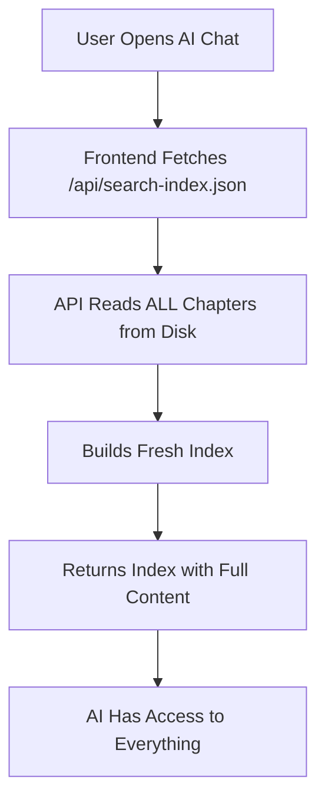

# AI Awareness Flow - How AI Knows About Book Content

## Overview
The AI chat feature has access to all book content through a dynamic search index system. Here's exactly how it works:

## 1. Content Sources
```
src/content/chapters/
├── chapter-1.md
├── chapter-2.md
└── ... (any new chapters added here)
```

## 2. Index Generation Flow

### Step 1: Content Collection
- When `/api/search-index.json` is requested, it runs `getCollection('chapters')`
- This automatically reads ALL markdown files from `src/content/chapters/`
- No manual rebuilding needed - happens on every request

### Step 2: Content Processing
For each chapter, the system:
1. Extracts title, description, and body content
2. Strips markdown formatting (headers, links, code blocks, etc.)
3. Normalizes Persian/Arabic text
4. Creates searchable document with:
   - Title
   - Description
   - Full text content
   - Keywords

### Step 3: Index Building
- Uses MiniSearch library for fuzzy Persian/Arabic search
- Tokenizes text properly for RTL languages
- Stores full content for AI to read

## 3. AI Access Flow



### When User Asks AI a Question:
1. **Search Phase**: AI searches the index for relevant chapters
2. **Context Building**: Retrieves full text of relevant chapters
3. **Response Generation**: Uses chapter content to answer accurately

## 4. Automatic Updates

**Key Point**: The AI automatically knows about new chapters!

- ✅ Add new chapter file → AI immediately aware (on next chat open)
- ✅ Edit existing chapter → AI sees updates immediately
- ✅ Delete chapter → AI won't reference it anymore
- ✅ No build process needed
- ✅ No cache to clear
- ✅ Works in dev and production

## 5. What AI Can Access

For each chapter, AI has:
- **Full markdown content** (entire chapter text)
- **Title** and **description**
- **Chapter number** and **slug**
- **Language** (fa/ar/en)

## 6. Caching Behavior

- **Server-side**: 1-hour cache (`Cache-Control: max-age=3600`)
- **Client-side**: Fetches fresh on each modal open
- **Dev mode**: No aggressive caching

## 7. Testing AI Awareness

To verify AI knows about new content:

1. Add/edit a chapter file
2. Save the file
3. Open AI chat (Ctrl+Shift+K or ⌘⇧K)
4. Ask: "چه فصل‌هایی در کتاب وجود دارد؟"
5. Or ask about specific content from new chapter

## 8. Troubleshooting

If AI doesn't see new content:

1. **Check file location**: Must be in `src/content/chapters/`
2. **Check file format**: Must be `.md` with proper frontmatter
3. **Refresh browser**: Force refresh with Ctrl+F5
4. **Check API**: Visit `http://localhost:4321/api/search-index.json`
   - Should see all chapters in `documents` array
5. **Restart dev server**: Only if file watcher failed

## 9. Technical Implementation

**Files involved**:
- `/src/pages/api/search-index.json.ts` - Generates index
- `/src/layouts/BookLayout.astro` - AI chat UI and fetch logic
- `/src/lib/persian-utils.ts` - Text processing
- `/src/content/chapters/*.md` - Source content

**No database or build step** - Everything is:
- File-based
- Dynamic
- Real-time
- Automatic

## Summary

**The AI is ALWAYS aware of ALL chapters** because:
1. Index is generated fresh on each request
2. Reads directly from file system
3. No intermediate build steps
4. No manual index rebuilding needed

Just add/edit markdown files and the AI knows!